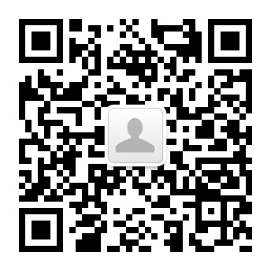

# WorkingTime

  

## 项目介绍

WorkingTime公司作息表是由中国民间程序员自行搭建的数据平台，用于各行业从业者分享自身的作息时间表。本项目自发布以来，即受到以互联网从业者为代表的各界人士之关注，平台的形式也由最初的共享文档发展为如今的微信小程序。平台开发团队正逐步完善平台的功能，进一步扩大平台的影响力，将有益的共享信息带给更多的从业者。

自问世以来，本项目的定位即是**为共享信息提供空间服务**。我们致力于推动各行业从业者作息时间的透明化，为从业者提供有益的参考。未经团队允许，平台中的所有数据暂不用于任何其他目的，包括但不限于商业运营、学术研究、非盈利报告等。我们坚决履行管理平台应尽的法定和道德义务，坚决抵制违法违规和弄虚作假的数据。除此以外，**平台本身及开发团队对平台数据无任何立场，也不对数据进行任何内容修改，仅提供空间服务**。我们欢迎各行业从业者在平台上分享自己的作息时间表：你的参与是在帮助千千万万个你。

由于团队的精力有限，平台将专注于维护**民营企业**的作息时间表数据。我们欢迎来自其他行业的数据，但这些数据的查询与展示在现阶段将不在平台服务范围之内。

## 如何奉献自己的一份力

首先，我们对在项目开发和维护期间给我们提供帮助和建议的所有人士表示衷心地感谢！

如果您想向我们的平台分享您个人的作息时间表，请点击以下链接：[数据收集问卷](https://f.wps.cn/w/UALnnS9T/#write) 并填写问卷。您的作息时间表将帮助到无数后来者！

如果您对本项目有任何意见和建议，或对数据条目有任何异议，请点击以下链接：[反馈建议问卷](https://f.wps.cn/w/6aPgKxSz/#write) 并填写问卷，或将您的建议发送至以下邮箱：WorkingTime.cn@gmail.com。我们热切希望收到大家的反馈！

## 如何访问平台数据

目前，我们提供两种查看作息时间表数据的方式：

- 通过我们的微信小程序 WorkInfo 查询特定的作息时间表记录。
- 直接访问数据总表（目前暂使用金山文档作为平台）。

#### 微信小程序

  

微信小程序WorkInfo（小程序码如上图）现提供本平台所有作息时间表数据的查询服务。您可根据小程序首页的提示，在搜索框中输入感兴趣的机构与岗位的信息。小程序将提供平台维护的相关作息时间表记录。

#### 数据总表

如您想直接访问平台的所有数据记录，可访问以下链接：https://www.kdocs.cn/l/cp4FGZt0yUr5。所有数据记录暂存于以上金山文档中。

## 重要链接

如您想和本平台的开发者和其他用户进行交流，可申请加入群组：516502728

本项目官网：https://tutou.site

本项目Github地址：https://github.com/WorkerLivesMatter/WorkingTime

本项目官网微信公众号：

## 声明

#### 数据真实性

本平台数据来自各行业从业者为主体的用户填写的信息，仅供用户参考。我们并不保证数据的真实性。除删去有违规风险的数据记录外，我们不参与任何形式的数据编辑和内容更改，仅对数据提供空间服务。

#### 数据是否机密

本平台数据为从业者个人自愿分享的作息时间。公司部门岗位只是从业者生活的工作部分。因此，本平台数据不从属于任何企业的机密数据。例如：公司规定18：00下班，从业者个人可以选择21：00点下班。

#### 数据所有权

本数据属于所有分享了数据的从业者集体所有。只要您分享了数据，则默认您愿意将此数据的所有权交给分享者集体所有。个人如分享个人作息后有所不便的可以自行删除。对于所有的数据，公司作息表团队拥有使用权，任何人都可以出于个人查看的目的对数据进行下载。未经本团队允许，数据禁止用于任何其他目的，包括但不限于商业用途、学术研究、非盈利性的报告、新闻报道等。如有第三方违规使用数据，WorkingTime团队保留追诉权力。

#### 违规行为处理

对于所有的数据，WorkingTime团队具有管理的义务。若有数据涉及违规行为，WorkingTime团队会在最快时间内相关数据记录删除。我们同样欢迎社会各界的监督。可通过联系邮箱：WorkingTime.cn@gmail.com 举报违规的数据记录。

#### 违规行为界定

1. 发布违反国家相关法律法规及七条底线九不准管理规定的信息，主要表现为
   - 反对宪法所确定的基本原则
   - 危害国家安全，泄露国家秘密，颠覆国家政权，破坏国家统
   - 损害国家荣誉和利益
   - 煽动民族仇恨、民族歧视，破坏民族团结                                
   - 破坏国家宗教政策，宣扬邪教和封建迷信
   - 散布谣言，扰乱社会秩序，破坏社会稳定
   - 宣扬淫秽、色情、赌博、暴力、凶杀、恐怖或者教唆犯罪
   - 煽动非法集会、结社、游行、示威、聚众扰乱社会秩序诽谤他人，泄露他人隐私，侵害他人合法权益
   - 含有法律、行政法规禁止的其他内容的信息
2. 破坏交流秩序的不友善行为
   - 羞辱、谩骂、攻击 他人的行为
   - 骚扰、恐吓、威胁、诽谤 他人的行为
   - 恶意煽动 他人攻击、羞辱或以其他不友善行为对待其他用户
   - 涉及民族、种族、宗教、性取向、性别、年龄、地域、生理特征等+身份或者归类而歧视、侮辱、攻击他人的行为
   - 泄露他人隐私，或者其他侵犯他人合法权益的行为
   - 频繁爆料不可信数据或者虚构薪资数据等不真实行为其他对 Working Time平台造成恶劣影响的行为
3. 发布垃圾广告信息，包括并不限于
   - 通过添加超链接的方式，进行SEO优化推广
   - 发布营销链接、二维码、qq号、微信号、内推码并在平台中进行恶意传播
   - 发布低质量投资类文章、虚假求职信息
   - 以评论或爆料薪资形式进行广告营销、拉关注
4. 抄袭行为及其他恶意行为
   - 对他人的原创内容进行篡改、删减的抄袭行为
   - 其他恶意行为：滥用产品功能，进行破坏平台秩序以及影响用户体验的行为。主要表现为：刷数据，有目的性的恶意刷赞、刷阅读量；诱导关注，通过发布评论、简信等相关形式引导关注制作及传播外挂或者用于操作帐号功能的恶意程序或相关教程；发布含有潜在危险的內容，如钓鱼网站、木马、病毒网站等；利用头像以及个人简介等信息冒充他人

#### 特别声明

本平台坚决贯彻维护国家安全与利益的立场，坚决履行保守国家秘密的义务。任何上传的数据记录都将经过管理团队审核。为减轻团队的工作负担，我们呼吁敏感行业的从业人员不要提交自己的作息时间数据。平台对此类数据提交也将在最短时间内予以屏蔽与彻底删除。如本项及以上所提及工作有不足之处，欢迎大家指正，也敬请各位谅解。

## 致谢

感谢 一学习就犯困 T A c f 秃头才能变强 和所有贡献了数据的兄弟们。 感谢 r 提供方法解决了恶意编辑的问题。

