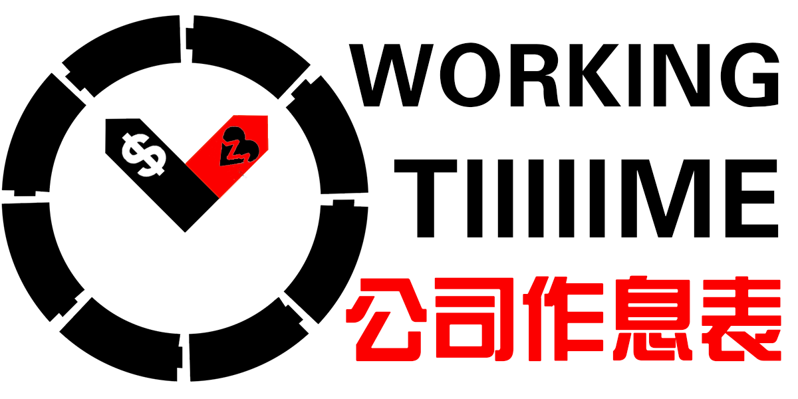

# WorkingTime

## 最后的声明 2021/10/28

由于本项目的公众号，共享文档，小程序均遭到永久封禁，本项目已暂停运营。目前，团队已将最新的数据上传至 Github，供大家下载查看。
“溯洄从之，道阻且长”，我们和大家的路仍在走，这个世界仍将运转。感谢关注支持这个项目的所有人。

请尽快备份，点击链接直接下载：https://tutou.site/workingtime.rar

官网：https://tutou.site

官网有可能被封禁，我们能保证的唯一永久地址是 **GitHub WorkingTime**：https://github.com/WorkerLivesMatter/WorkingTime

## 项目封禁历史

- 10.13
    - 总表被举报致封禁，数小时后解封
    - 出现盗版小程序，出现盗版QQ群
    - 官网 https://www.tutou.site 上线

- 10.14

    - QA表被封，数小时后解封
    - 考虑法律问题，发表声明

- 10.15 腾讯封禁 GitHub 地址

- 10.16 内部项目管理文档被封

- 10.17 数据收集问卷被封

- 10.18 创建新问卷依旧被封

- 10.19

    - 小程序 WorkInfo 上线
    - 开放了备份下载
    - 知乎问题被删除
    - 总表被删除
    - 公众号 WorkInfo 创建

- 10.20 

    - 表格迁移至金山文档
    - 宣传本项目的公众号文章开始被删除

- 10.21 发布特别声明，拒绝一切境外媒体的采访

- 10.22 金山删除文档

- 10.24 QQ/百度/夸克/UC/微信 屏蔽了官网和 GitHub 的链接

- 10.25 收集表被封

- 10.28 小程序和公众号被永久封禁

    

## 项目介绍

WorkingTime公司作息表是由中国民间程序员自行搭建的数据平台，用于各行业从业者分享自身的作息时间表。本项目自发布以来，即受到以互联网从业者为代表的各界人士之关注，平台的形式也由最初的共享文档发展为如今的微信小程序。平台开发团队正逐步完善平台的功能，进一步扩大平台的影响力，将有益的共享信息带给更多的从业者。

自问世以来，本项目的定位即是**为共享信息提供空间服务**。我们致力于推动各行业从业者作息时间的透明化，为从业者提供有益的参考。未经团队允许，平台中的所有数据暂不用于任何其他目的，包括但不限于商业运营、学术研究、非盈利报告等。我们坚决履行管理平台应尽的法定和道德义务，坚决抵制违法违规和弄虚作假的数据。除此以外，**平台本身及开发团队对平台数据无任何立场，也不对数据进行任何内容修改，仅提供空间服务**。我们欢迎各行业从业者在平台上分享自己的作息时间表：你的参与是在帮助千千万万个你。

由于团队的精力有限，平台将专注于维护**民营企业**的作息时间表数据。我们欢迎来自其他行业的数据，但这些数据的查询与展示在现阶段将不在平台服务范围之内。

## 如何访问平台数据

目前，我们提供两种查看作息时间表数据的方式：

- 通过官网 www.tutou.site 查询特定的作息时间表记录。
- 自行下载 GitHub 备份查看。

## 如何奉献自己的一份力

首先，我们对在项目开发和维护期间给我们提供帮助和建议的所有人士表示衷心地感谢！

如果您想向我们的平台分享您个人的作息时间表，请通过官网 https://www.tutou.site 提交数据

## 联系我们

如果您对本项目有任何意见和建议，或对数据条目有任何异议，请通过如下方式联系我们。我们热切希望收到大家的反馈！

+ 邮箱：WorkingTime.cn@gmail.com

## 声明

### 特别申明：

本平台坚决贯彻维护国家安全与利益的立场，坚决履行保守国家秘密的义务。任何上传的数据记录都将经过管理团队审核，坚决不允许出现任何违反国家相关法律法规的信息。未经团队允许，平台中的所有数据不得用于任何其他目的，包括但不限于商业运营、学术研究、非盈利报告、新闻报道等。我们坚决履行管理平台应尽的法定和道德义务，坚决抵制违法违规和弄虚作假的数据。

### 声明一：搜索数据

一、数据是否真实：本平台数据来自各行业从业者为主体的用户填写的信息，仅供用户参考。 我们并不保证数据的真实性。除删去有违规风险的数据记录外，我们不参与任何形式的数据编辑和内容更改，仅对数据提供空间服务。

二、数据是否机密： 本平台数据为从业者个人自愿分享的作息时间，不代表公司正式规定的工作时间。公司部门岗位只是从业者生活的工作部分。 因此，本平台数据不从属于任何企业的机密数据。例如：公司规定 18:00 下班，从业者个人可以选择 21:00 点下班。

三、“公司作息表“上的数据属于所有分享了数据的从业者集体所有。只要您在”公司作息表“上分享过数据，则默认您愿意将此数据的所有权交给分享者集体所有。个人如分享个人作息后有所不便的可以自行删除。对于所有的数据，公司作息表团队拥有使用权，任何人都可以出于个人查看的目的对数据进行下载。未经本团队允许，数据禁止用于任何其他目的，包括但不限于商业用途、学术研究、非盈利性的报告、新闻报道等。如有第三方违规使用数据，WorkingTime 团队保留追诉权力。

### 声明二：提交数据

一、用户在平台提交的数据，应是贯彻自愿分享原则、开源精神。平台没有诱导/暗示用户在平台进行数据的上传或提交。且用户所提交的数据，应是用户自愿分享的个人作息休息时间。

二、用户在平台发布的数据，平台方具有使用权。平台提交/发布的数据信息未经团队允许，任何人不得盗用并使用。数据禁止用于任何其他目的，包括但不限于商业用途、学术研究、非盈利性的报告、新闻报道等。如有第三方违规使用数据，WorkingTime 团队保留追诉权力！

三、希望大家维护一个良好的信息共享氛围，提交的数据中不得有违反国家法律法规言语或诽谤、攻击具体（公司 / 人）的措辞或言语。一经发现有相关违规事实团队会及时采取行动，保留相关证据后删除数据。

四、由于目前团队人手有限，提价数据后审核时间可能需要等待一定时间，一经通过审核后数据便会在平台上线，望请谅解。

### 声明三：违规行为处理

对于所有的数据，公司作息表团队享有管理的义务。若有数据涉及违规行为，公司作息表团队会将该数据删除，同时也欢迎广大朋友监督。

#### 违规行为界定

1. 发布违反国家相关法律法规及七条底线九不准管理规定的信息，主要表现为
    + 反对宪法所确定的基本原则
    + 危害国家安全，泄露国家秘密，颠覆国家政权，破坏国家统
    + 损害国家荣誉和利益
    + 煽动民族仇恨、民族歧视，破坏民族团结 
    + 破坏国家宗教政策，宣扬邪教和封建迷信
    + 散布谣言，扰乱社会秩序，破坏社会稳定
    + 宣扬淫秽、色情、赌博、暴力、凶杀、恐怖或者教唆犯罪
    + 煽动非法集会、结社、游行、示威、聚众扰乱社会秩序诽谤他人，泄露他人隐私，侵害他人合法权益
    + 含有法律、行政法规禁止的其他内容的信息

2. 破坏交流秩序的不友善行为
    + 羞辱、谩骂、攻击 他人的行为
    + 骚扰、恐吓、威胁、诽谤 他人的行为
    + 恶意煽动 他人攻击、羞辱或以其他不友善行为对待其他用户
    + 涉及民族、种族、宗教、性取向、性别、年龄、地域、生理特征等+身份或者归类而歧视、侮辱、攻击他人的行为
    + 泄露他人隐私，或者其他侵犯他人合法权益的行为
    + 频繁爆料不可信数据或者虚构薪资数据等不真实行为其他对 Working Time平台造成恶劣影响的行为
3. 发布垃圾广告信息，包括并不限于
    + 通过添加超链接的方式，进行SEO优化推广
    + 发布营销链接、二维码、qq号、微信号、内推码并在平台中进行恶意传播
    + 发布低质量投资类文章、虚假求职信息
    + 以评论或爆料薪资形式进行广告营销、拉关注

4. 抄袭行为及其他恶意行为
    + 对他人的原创内容进行篡改、删减的抄袭行为
    + 其他恶意行为：滥用产品功能，进行破坏平台秩序以及影响用户体验的行为。主要表现为：刷数据，有目的性的恶意刷赞、刷阅读量；诱导关注，通过发布评论、简信等相关形式引导关注制作及传播外挂或者用于操作帐号功能的恶意程序或相关教程；发布含有潜在危险的內容，如钓鱼网站、木马、病毒网站等；利用头像以及个人简介等信息冒充他人

### 声明四：监督/投诉/反馈渠道

如对数据有异议/改进的意见，可发送邮件至WorkingTime.cn@gmail.com，团队会及时处理并反馈，欢迎大家监督。

## 致谢

感谢 一学习就犯困 T A c f 秃头才能变强 和所有贡献了数据的兄弟们。 感谢 r 提供方法解决了恶意编辑的问题。

